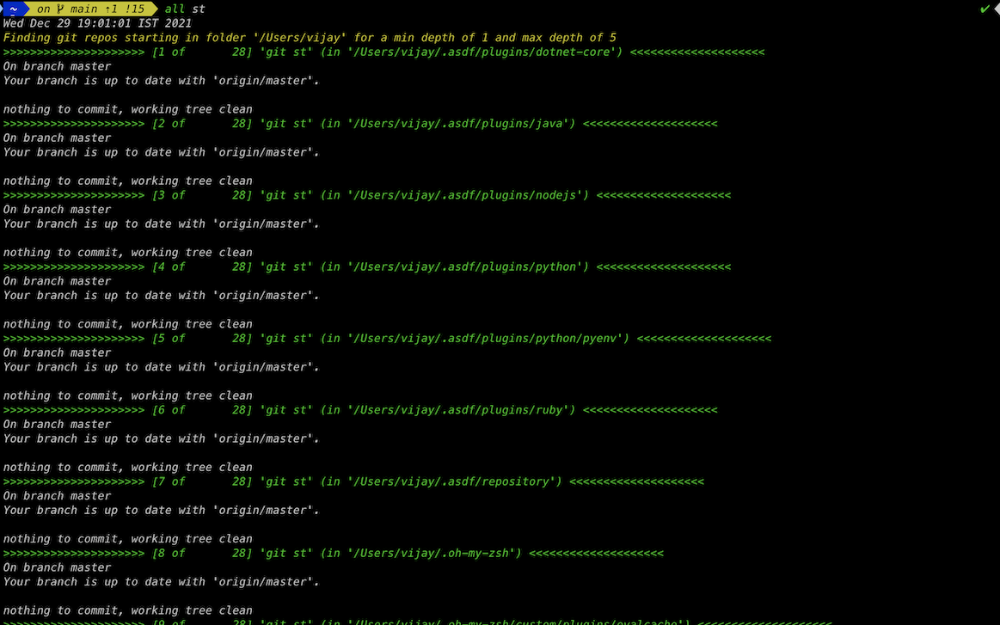

git_scripts
===========

These are some scripts that I use constantly when dealing with multiple git repositories.

## run_all.sh
----------
This script is typically run from the common parent directory.

With the latest update, the `run_all.sh` script can be configured to run against any level of subdirectory. Examples:

```bash
  run_all.sh git status                                      # to get the git status of all git repos
  run_all.sh git clean -fxd                                  # to clean all git repos
  run_all.sh git remote prune origin                         # to run the git remote prune command
  run_all.sh git add -p                                      # to add all modified (unstaged) files for a commit eventually
  run_all.sh find . -iname patch.txt --exec rm -rfv {} \;    # find all files with the name 'patch.txt'
```

You can also control the starting (parent) folder by specifying the `FOLDER` env var, the filter for mathing either the path and/or the name of the folders to be processed using `FILTER` and also sumultaneously control the depth using the `MINDEPTH` and `MAXDEPTH` env vars. So, for eg, to search in multuiple nested folders starting at `~/dev`, you can use the following command:

```bash
  FOLDER=~/dev MINDEPTH=2 MAXDEPTH=5 FILTER=oss run_all.sh git status
  FOLDER=~/dev MINDEPTH=2 MAXDEPTH=5 run_all.sh git fetch
```

To see more features based on env vars (and a more complete description), please see [run_all.sh](run_all.sh)

Note: Any command can be run (whether they are specific to the shell that you are currently using) or git commands. These commands are run within the context of each child git repository.



## clean_from_git_history
----------
Script to permanently delete files/folders from your git repository. To use it, cd to your repository's root and then run the script with a list of paths you want to delete, e.g., `git-delete-history path1 path2`

## cleanup_all_gems
----------
Script to cleanup all installed gems (if you do not want to simply delete the gem install directory)

## delete_merged_branches
----------
After merging local changes into branches and pushing them to the respective remote-tracking branches, you might want to clean your local machine. This script is used to ensure the first is done and then will cleanly delete the synced branches from local.

## file_sizes
----------
Script to see how much disk space each folder/item in your git repo is holding

## run_all.ps1
----------
Powershell clone of the `run_all.sh` - but, as yet, unmaintained since I do not have access to a Windows machine.
